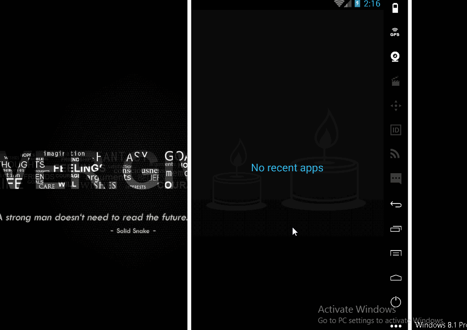

# HabitTrackerProject
An small demo app to complete the project 8. See the Tutorial on our cliffnotes for a step-by-step tutorial.

Time spent: 8 hours implementation (included searching) in total
 - 07/24: 8 hours

Implement link: https://github.com/TienVNguyen/HabitTrackerProject

 - Layout:
 * [x] Overall Layout: No UI is required for this project.

 - Functionality:
 * [x] Compile time Errors: The code compiles without errors.
 * [x] Table Definition: There exists a contract class that defines name of table and constants. Inside the contract class, there is an inner class for each table created.
 * [x] Table Creation: There exists a subclass of SQLiteOpenHelper that overrides onCreate() and onUpgrade() and contains an implemented deleteDatabase()
 * [x] Data Insertion: There is a single insert method that adds at least two values of two different datatypes (e.g. INTEGER, STRING) into the database using a ContentValues object and the insert() method.
 * [x] Data Reading: There is a single read method that returns a Cursor object. It should get the data repository in read and use the query() method to retrieve at least one column of data.
 * [x] Data Deletion: There is a single delete method that deletes all the entries from the table.
 * [x] Data Updating: There is a single update method that updates at least one value in one column in the table.
 * [x] External Libraries and Packages: No external libraries (e.g. Realm) are used for the database code, and no Content Providers is used. All data insertion, reading, deletion, and updating should be done using direct method calls to the SQLite database in the SQLiteOpenHelper class.
 

 - Code Readability:
 * [x] Readability: Code is easily readable such that a fellow programmer can understand the purpose of the app.
 * [x] Naming conventions : All variables, methods, and resource IDs are descriptively named such that another developer reading the code can easily understand their function.
 * [x] Formatting : The code is properly formatted i.e. there are no unnecessary blank lines; there are no unused variables or methods; there is no commented out code. The code also has proper indentation when defining variables and methods.
 

Notes:

Walkthrough of all functionalities:

